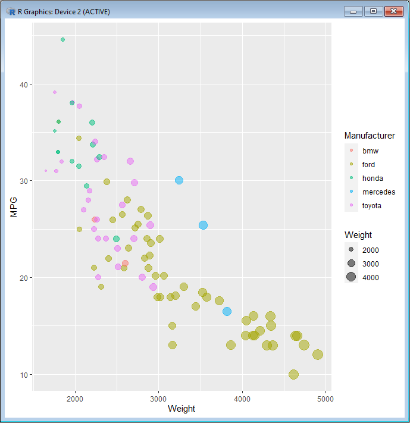

# 02-DataVis-5ways

Nicholas Alescio - Assignment 2 - Data Visualization, 5 Ways  
===

In this project, five visualizations were created for one dataset. Three languages (JavaScript, Python, R) and two visualization tools (Flourish, PowerBI) were used in this project.

# R + ggplot2

R is a language primarily focused on statistical computing.
ggplot2 is a popular library for charting in R.

To visualized the cars dataset, I made use of ggplot2's `geom_point()` layer, with aesthetics functions for the color and size.

Since I had never used R before, it took me a decent amount of time just to figure out how to run a script... eventually I found good documentation and everything worked out!

# d3.js

D3 is a JavaScript library for visualizing data with HTML, SVG, and CSS.

The challenge here was finding a way to make everything actually appear in the location I wanted things to be (my circles kept rendering off the screen). Margins helped me tremendously with solving that issue. I also included some code to hide n/a values.

# Python + Seaborn

Python is an interpreted language that can be used for pretty much any high-level task, popular due to its vast amounts of libraries. For this viz, the Seaborn library (based on matplotlib) was used. This viz was the most straightforward and caused me the least issues. The only complication I ran into was having to use the pandas library to import the csv, since it was being pulled locally and not over the internet.

## Technical Achievements
- **Proved P=NP**: Using a combination of...
- **Solved AI Forever**: ...

### Design Achievements
- **Re-vamped Apple's Design Philosophy**: As demonstrated in my colorscheme...
